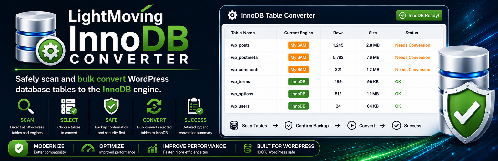

# 🛠 InnoDB Table Converter


Safely scan and bulk convert WordPress database tables from legacy storage engines such as MyISAM to InnoDB.

---

## 🔍 Overview

InnoDB Table Converter helps modernize older WordPress databases that still contain tables using MyISAM or other legacy storage engines.

The plugin scans your WordPress database tables, identifies tables needing conversion, and provides a safe administrator-controlled bulk conversion workflow.

---

## ⚡ Features

- WordPress table engine scan
- Bulk conversion to InnoDB
- Selected-table conversion controls
- Backup confirmation workflow
- Required CONVERT confirmation step
- Table row and size display
- Clean conversion logging
- Responsive modern admin interface
- No automatic conversion on activation
- Direct Tools link from Plugins page
- Translation-ready POT language template

---

## 🖥 Designed For

This utility is especially useful for:

- older WordPress websites
- migrated hosting environments
- legacy MyISAM tables
- database modernization
- WordPress Site Health recommendations
- Themify and older builder installs

---

## 🔒 Safety First

The plugin intentionally requires:

- administrator access
- backup confirmation
- manual CONVERT confirmation

No database conversion occurs automatically on activation.

---

## 📦 Installation

1. Upload the plugin to `/wp-content/plugins/`
2. Activate the plugin
3. Go to:

```txt
Tools → InnoDB Converter
```

4. Review your table engine status
5. Create a complete database backup
6. Run the selected-table conversion workflow

---

## 🔄 Conversion Workflow

The plugin:

1. Scans WordPress tables using the active prefix
2. Identifies tables not using InnoDB
3. Shows engine, row count, and table size
4. Allows table selection/deselection
5. Requires administrator confirmation
6. Converts selected tables to InnoDB
7. Displays a clean conversion summary log

---

## 🧠 Example Conversion Query

```sql
ALTER TABLE wp_posts ENGINE=InnoDB;
```

---

## 📸 Screenshots

### Table Engine Scan
Review table names, current storage engines, row counts, and estimated table size.

### Safe Conversion Workflow
Backup confirmation and manual CONVERT verification before conversion.

### Conversion Success Summary
Clean logging and confirmation after selected tables are converted.

---

## 📜 Changelog

### 1.0.1
- Improved WordPress.org release packaging
- Confirmed contributor metadata
- Improved README.md documentation
- Added fuller translation-ready POT language template
- Confirmed Plugin Check-friendly database operation documentation

### 1.0.0
- Initial release
- WordPress table engine scanning
- Selected-table InnoDB conversion workflow
- Backup confirmation system

---

## ⚖ License

GPL v2 or later
